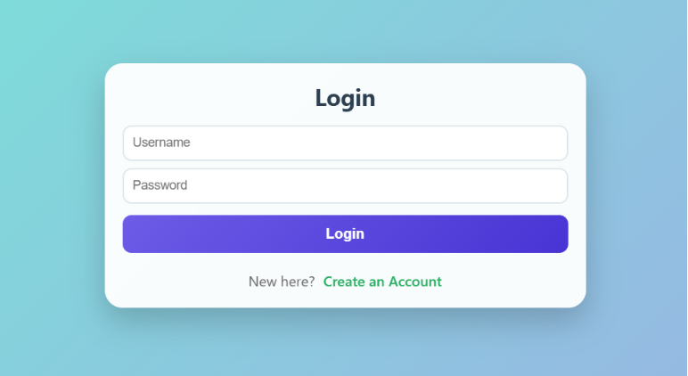
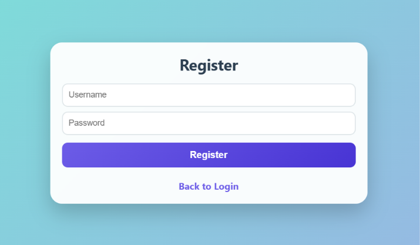
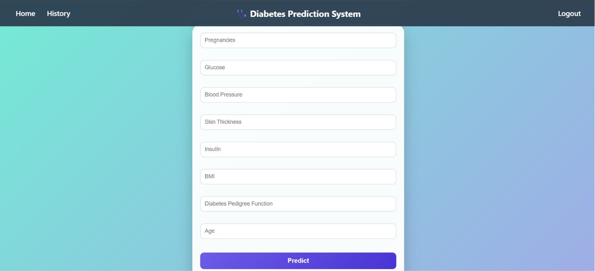
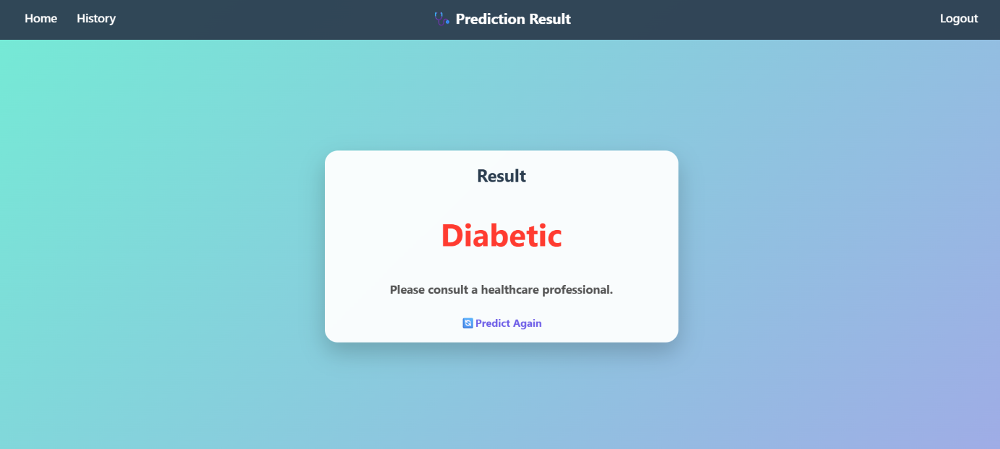
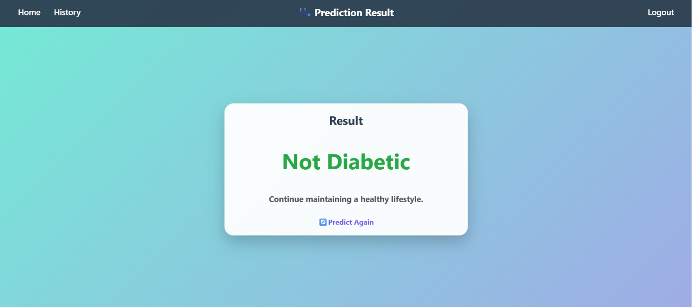
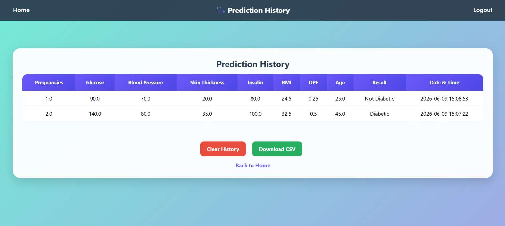

# 🩺 Diabetes Prediction System

<div align="center">


### End-to-End Machine Learning Web Application for Diabetes Prediction

Predict whether a patient is diabetic or non-diabetic using machine learning and track prediction history through a secure web application.

</div>


## 🧠 About the Project

Diabetes is one of the most common chronic diseases worldwide, and early detection can significantly improve patient health outcomes. This project is an end-to-end Machine Learning web application that predicts whether a person is likely to have diabetes based on key medical attributes.

The system combines a trained Random Forest machine learning model with a Flask-based web application, allowing users to securely register, log in, make predictions, and track their prediction history.

### What this project covers:

* Data preprocessing and handling missing values
* Feature scaling using StandardScaler
* Training and evaluating multiple machine learning models
* Model selection through experimentation
* Serializing the best-performing model for deployment
* Building a complete Flask web application
* User authentication with secure password hashing
* Prediction history management using SQLite
* CSV export functionality for prediction records
* Responsive and user-friendly interface


## 📊 Dataset

| Property | Details |
|----------|----------|
| **Name** | Pima Indians Diabetes Dataset |
| **Source** | Kaggle / UCI ML Repository |
| **Samples** | 768 patients |
| **Features** | 8 numeric diagnostic features |
| **Target** | Binary — 1 (Diabetic) / 0 (Non-Diabetic) |
| **Class Balance** | ~65% Non-Diabetic · ~35% Diabetic |

## 🔬 Features Used

| Feature | Description |
|----------|----------|
| `Pregnancies` | Number of times pregnant |
| `Glucose` | Plasma glucose concentration (2-hour oral glucose tolerance test) |
| `BloodPressure` | Diastolic blood pressure (mm Hg) |
| `SkinThickness` | Triceps skin fold thickness (mm) |
| `Insulin` | 2-hour serum insulin (µU/ml) |
| `BMI` | Body mass index (weight in kg / height in m²) |
| `DiabetesPedigreeFunction` | Likelihood of diabetes based on family history |
| `Age` | Age in years |

## 🤖 Model & Performance

Multiple machine learning classifiers were trained and evaluated. The best-performing model was selected for deployment.

| Model | Accuracy | Precision | Recall | F1-Score |
|---------|:--------:|:---------:|:------:|:--------:|
| Logistic Regression | 0.78 | 0.78 | 0.54 | 0.64 |
| Decision Tree | 0.97 | 0.94 | 0.99 | 0.96 |
| **Random Forest**  | **0.99** | **0.99** | **0.99** | **0.99** |

>  **Random Forest** was selected as the final model due to its superior performance across all evaluation metrics.

### Preprocessing Steps

- Replaced invalid zero values with feature medians
- Feature scaling using StandardScaler
- Train-Test Split (80% Training, 20% Testing)
- Model evaluation using Accuracy, Precision, Recall, and F1-Score

### Final Model Performance

```text
Accuracy: 0.99

Classification Report:

              precision    recall    f1-score   support

           0       0.99      0.99      0.99       253
           1       0.99      0.99      0.99       147

    accuracy                           0.99       400
   macro avg       0.99      0.99      0.99       400
weighted avg       0.99      0.99      0.99       400
```

## 📁 Project Structure

```text
Diabetes_Prediction/
│
├── diabetes_pipeline/
│   │
│   ├── dataset/
│   │   └── kaggle_diabetes.csv
│   │
│   ├── experiments/
│   │   ├── __init__.py
│   │   ├── experiment_runner.py
│   │   └── results.csv
│   │
│   ├── logs/
│   │   └── training.log
│   │
│   ├── config.py
│   ├── data_preprocessing.py
│   ├── train.py
│   ├── evaluate.py
│   └── predict.py
│
├── Diabetes_prediction_deployed/
│   │
│   ├── resource/
│   │   ├── login_Page.png
│   │   ├── Register_Page.png
│   │   ├── Main_Page.png
│   │   ├── Diabetic_Page.png
│   │   ├── Not_Diabetic_Page.png
│   │   └── History_Page.png
│   │
│   ├── static/
│   │   └── style.css
│   │
│   ├── templates/
│   │   ├── index.html
│   │   ├── login.html
│   │   ├── register.html
│   │   ├── result.html
│   │   └── history.html
│   │
│   ├── app.py
│   ├── init_db.py
│   ├── database.db
│   ├── diabetes_model.pkl
│   ├── scaler.pkl
│   └── requirements.txt
│
├── Diabetes_Classification.ipynb
├── README.md
└── .gitignore
```

## 🛠️ Tech Stack

### Machine Learning

* Python
* NumPy
* Pandas
* Scikit-Learn

### Backend

* Flask
* SQLite
* Flask Sessions
* Flask-Bcrypt

### Frontend

* HTML
* CSS


## ⚙️ Installation

### Clone Repository

```bash
git clone https://github.com/Rajeevreddy-2006/Diabetes-Prediction-System.git
cd Diabetes-Prediction-System
```

### Create Virtual Environment

```bash
python -m venv venv
```

### Activate Virtual Environment

Windows:

```bash
venv\Scripts\activate
```

### Install Dependencies

```bash
pip install -r requirements.txt
```

### Initialize Database

```bash
python Diabetes_prediction_deployed/init_db.py
```

### Run Application

```bash
python Diabetes_prediction_deployed/app.py
```

Application will run on:

```text
http://127.0.0.1:5000
```


## 📸 Screenshots

### Login Page



### Registration Page



### Prediction Page



### Prediction Result




### Prediction History



## ⚠️ Current Limitations

- The application currently uses SQLite for data storage.
- The `database.db` file is not tracked in Git and is excluded through `.gitignore`.
- During redeployment, a new database may be created, causing registered users and prediction history to be reset.
- The application is intended for demonstration and learning purposes at its current stage.

## 🔮 Future Improvements

* Prediction Confidence Score
* Interactive Dashboard
* Email Notifications
* Cloud Deployment
* Advanced Data Visualization

## 📚 References

- [Pima Indians Diabetes Dataset — Kaggle](https://www.kaggle.com/datasets/uciml/pima-indians-diabetes-database)

- [Scikit-Learn Documentation](https://scikit-learn.org/stable/)

- [Flask Documentation](https://flask.palletsprojects.com/en/stable/)

---